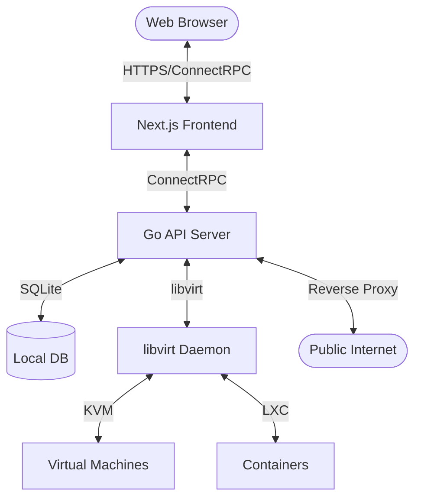

# Lab - Modern Virtualization Management Platform

[](https://github.com/doomedramen/lab/actions/workflows/ci.yml)
[](https://github.com/doomedramen/lab/actions/workflows/release.yml)
[](https://opensource.org/licenses/MIT)
[](https://go.dev/)
[](https://nextjs.org/)

**Lab** is a modern, lightweight virtualization management platform designed for home servers. It provides a beautiful, responsive web interface to manage your virtual machines, containers, networks, and storage without the overhead of enterprise-grade hypervisors.

Built with performance and simplicity in mind, Lab leverages **libvirt**, **QEMU/KVM**, and **LXC** to give you full control over your hardware.

---

## 🚀 Key Features

### 🖥️ VM & Container Management
- **Full VM Lifecycle**: Create, start, stop, pause, and clone VMs with ease.
- **Advanced Hardware**: Support for **TPM 2.0**, **Secure Boot**, and **PCI/GPU Passthrough**.
- **LXC & Docker**: Native support for LXC containers and Docker Compose stacks.
- **Resource Control**: Dynamically adjust CPU, memory, and boot order.

### 📊 Observability & Monitoring
- **Real-time Metrics**: Live charts for CPU, RAM, disk, and network I/O.
- **Uptime Monitoring**: Integrated health checks for your services with historical data.
- **Task Tracking**: Background job monitoring with real-time status updates.
- **Centralized Logging**: Persistent logs for all virtual machines and containers.

### 🌐 Networking & Proxy
- **Integrated Reverse Proxy**: Domain-based routing with automatic SSL (ACME/Certbot support).
- **Virtual Networks**: Manage bridges, NAT networks, and firewall rules.
- **Consoles**: Built-in high-performance **VNC** and **Serial** consoles.

### 🛡️ Storage & Security
- **Storage Pools**: Manage directory, LVM, and ZFS pools.
- **Snapshots & Backups**: Point-in-time snapshots and scheduled backups with retention policies.
- **Security First**: JWT-based authentication with MFA support and role-based access control (RBAC).
- **Alerting**: Configurable alerts via Email (SMTP) or Webhooks.

---

## 🛠️ Tech Stack

| Component | Technology |
|-----------|------------|
| **Frontend** | [Next.js 15](https://nextjs.org/), [React](https://react.dev/), [TypeScript](https://www.typescriptlang.org/), [Tailwind CSS](https://tailwindcss.com/), [shadcn/ui](https://ui.shadcn.com/) |
| **Backend** | [Go 1.23+](https://go.dev/), [chi](https://github.com/go-chi/chi), [ConnectRPC](https://connectrpc.com/) |
| **API** | Protobuf / gRPC / Connect |
| **Database** | [SQLite](https://sqlite.org/) (embedded with WAL mode) |
| **Virtualization** | [libvirt](https://libvirt.org/), [QEMU/KVM](https://www.qemu.org/), [LXC](https://linuxcontainers.org/) |
| **DevOps** | [pnpm](https://pnpm.io/), [Turbo](https://turbo.build/), [Playwright](https://playwright.dev/) (E2E) |

---

## ⚡ Quick Start

### Prerequisites
- **OS**: Linux (Ubuntu 22.04+, Debian 12+, Fedora 39+, Arch)
- **Virtualization**: Intel VT-x or AMD-V enabled in BIOS
- **Software**: `libvirt`, `qemu-system-x86`, `pnpm`, `go`, `node`

### Development
```bash
# Clone the repository
git clone https://github.com/doomedramen/lab.git
cd lab

# Install dependencies
pnpm install

# Start development servers (API & Web)
pnpm dev
```
Open **http://localhost:3000** to access the dashboard.

### Production Build
```bash
# Build the static web UI
pnpm --filter web build

# Build the API server
cd apps/api
go build -o bin/lab-server ./cmd/server
```

For detailed production setup, including **systemd** service configuration, see the [Deployment Guide](./DEPLOYMENT.md).

---

## 🏗️ Architecture



---

## 🗺️ Roadmap

- [x] **Phase 1**: Operational Foundation (Task tracking, VM updates, Clone, Disk management)
- [x] **Phase 2**: Home Server Essentials (Alerting, Guest Agent, TPM 2.0, Secure Boot)
- [x] **Phase 5**: Reverse Proxy & Uptime Monitoring (Core proxy, monitoring loop)
- [ ] **Phase 2.4**: PCI / GPU Passthrough (In progress)
- [ ] **Phase 3**: Management & Hardening (Host shell, Boot order, Session mgmt)
- [ ] **Phase 4**: RBAC & Security Polish (User groups, IP whitelisting, TLS)
- [ ] **Phase 8**: Infrastructure as Code (Pulumi integration)

See [PLAN.md](./PLAN.md) for the full roadmap and implementation details.

---

## 📖 Documentation

- [Deployment Guide](./DEPLOYMENT.md) - Systemd, manual install, and requirements.
- [Architecture Deep Dive](./DEPLOYMENT_ARCHITECTURE.md) - Internal system design.
- [API Reference](./apps/api/README.md) - ConnectRPC service definitions.
- [Ideas & Vision](./IDEAS.md) - Brainstorming and future directions.

---

## 🤝 Contributing

We welcome contributions! Please follow these steps:
1. Fork the repo.
2. Create a feature branch (`git checkout -b feature/cool-new-thing`).
3. Commit your changes (`git commit -m 'Add some cool thing'`).
4. Push to the branch (`git push origin feature/cool-new-thing`).
5. Open a Pull Request.

Please see [CONTRIBUTING.md](./CONTRIBUTING.md) for more details.

---

## 📄 License

This project is licensed under the **MIT License**.

---

## 🙏 Acknowledgments

- **libvirt** for providing the industry-standard virtualization API.
- **Proxmox VE** for being a constant inspiration for home server management.
- **shadcn/ui** for the beautiful UI primitives.
- **ConnectRPC** for making type-safe APIs effortless.
